# Recommendation System

## 1.1. Overview
In this lab we will deploy a recommendation system from Azure Machine Learning Studio. We will focus on the *Train Matchbox Recommender* and *Score Matchbox Recommender* modules in order to understand the logic behind the the out-of-the-box recommendation solution in Azure Machine Learning Studio.

The recommender system we will work with, Matchbox Recommender, finds association rules among users and items, items themselves, or users themselves. That is it can help recommend:
* Items for specific or new users
    * *User A* is likely to choose *Item B*
* Related items
    * *Item A* is closely associated *Item B*  
* Related users
    * *User A* has similar tendencies to *User B*


 For technical information about the Matchbox Recommender see [Matchbox: Large Scale Online Bayesian Recommendations](http://research.microsoft.com/apps/pubs/default.aspx?id=79460) published by Microsoft Research. 
 
### 1.1.1. Objectives
This lab aims to demonstrate how to use a recommendation system within Azure Machine Learning Studio. It will show item recommendations to new and existing users, how to find related items, and related users. It will also walk you through the basics of how to test a Machine Learning model in excel and how to consume a deployed model inside a C# console application.  

## 1.2. Data
We will be using a small amount of a sythetic data to create a test experiment using the Matchbox Recommender. This data is located in the data folder as three CSV files:  
 -  users.csv
 -  items.csv
 -  ratings.csv

The format of each file is as follows:

**users.csv**
 
| customerId | type |
| --- | --- |
|c1	| v |
| ...	| ... |
|c7	| mv |
|c8	| m |
 
**items.csv**
 
| restaurantId | type |
| --- | --- |
| r1 |	m |
| ... | ... |
| r5 | v |
| r6 | mv |

 
**ratings.csv**
 
| customerId | restaurantId | rating |
| --- | --- | --- |
| c1 | r2 | 3 |
| c1 | r3 | 1 |
| ... | ... | ... |
| ... | ... | ... |
| c8 | r6 | 2 |


At a minimum, we will need the **ratings table** (*ratings.csv*) to use the Matchbox Recommender, otherwise we will need all three tables listed above (*users.csv*, *items.csv*, and *ratings.csv*). If we use all three tables, the Matchbox Recommender will work in **collaborative filtering mode**, which means the features of the items and users will be taken into consideration during the recommendation process. 

    Note: This is a small dataset used for training purposes only. With larger, more robust datasets the accuracy of the recommendations will improve.

### 1.2.1. Upload the Data  
To upload the datasets, follow steps 2-4 for each CSV file.  

1. Open your [Azure Machine Learning Workspace.](https://studio.azureml.net/?selectAccess=true&o=1)  

2. Click **NEW** on the bottom left of the page.  


3. Click **DATASET** and choose **FROM LOCAL FILE**.  


4. Navigate to the file "*ratings.csv*". Feel free to change the name of the dataset or enter a description if you'd like. Then click the *checkmark* button on the bottom right corner to upload the file.   
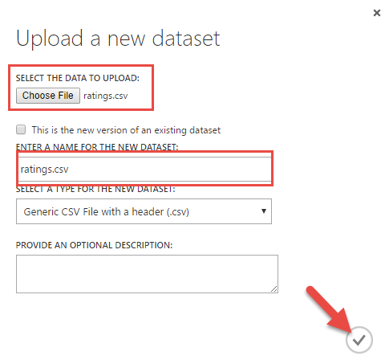

## 1.3. Recommend items to users
For this lab, we will build a very simple Machine Learning solutions by  skipping things like data manipulation, cleaning, splitting etc.  

1. Create a blank experiment.  

2. Build the following workflow by simply drag and dropping modules onto the canvas. 
* Datasets are located under “Saved Datasets” -> “My Datasets”. 
* *Train Matchbox Recommender* can be found in "Machine Learning" -> "Train"
* *Score Matchbox Recommender* is under "Machine Learning" -> "Score".

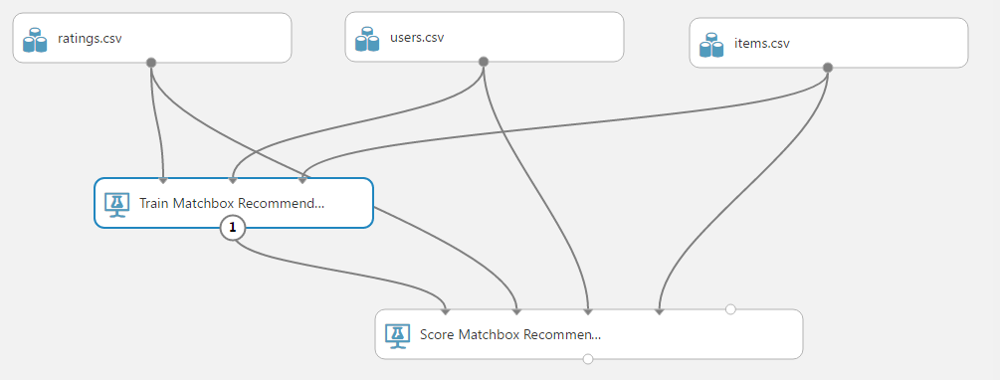 

3. Set the *Train Matchbox Recommender* module's **Number of Traits** property to 3. This is generally equal to the maximum number of ratings per user, which is 3 in our case.  

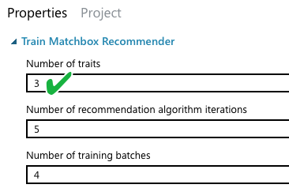 

4. Set the *Score Matchbox Recommender* module's **Recommender prediction kind** property to "Item Recommendation" and **Recommended item selection** property to "From all Items". Finally, set the "Maximum number of items to recommend..." to **3**.   

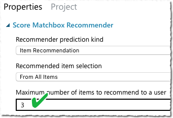 

5. Run the experiment and visualize the output port of the *Score Matchbox Recommender* module.  

  

    In the output window, the first column lists all the users. The remaining columns show the recommended items in order, for the user in that row.
    
    Because we set the *maximum number of items to recommend* to 3, the system tries to identify the top three most appropriate items to recommend. If we look closely at the first row, we can see that the 3rd item recommended for the first user is **r6**. This is the most appropriate choice within the available dataset but this will change as we add new data. 

6. Add the below two new rows of data into the rating.csv file. Then follow steps in section 1.2.1 to replace the existing CSV file, or you can simply use the "*Enter Data Manually*" module then copy/paste a new CSV content into the moudule. 

  

7. **RUN** the experiment and visualize the output port again.  

  

8. Now the recommended third item has changed from **r6** to **r3**. This is mainly because other users (the two new rows that we added) with similar profiles prefer **r3**. Now the system proposes **r3** to customer **c1** even though that customer has already rated it with one star in our dataset.

9. Set the "**Recommended item selection**" parameter to *From Rated Items...* and "**Minimum size of recommendation pool...**" to *4*.

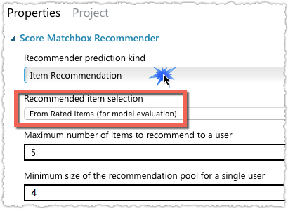 

10. Visualize the output port of the Score Matchbox Recommender module.

 

11. Here you can see that the system recommends only from a pool of items that user has rated. Also are no recommendations for user *c5*, *c6*, or *c7*. This is because these users rated less than four items but our pool condition parameter is set to *4*.  
    
12. You may have observed the two similar property values in *Recommender prediction kind* type: "From Rated Items" and "From All Items". In production, when you publish the solution as web service, your model's property should be set to "From All Items".

## 1.4. Find related users
Assume you want to match your users' customer profiles in order to find related users or users that have similar tendency. In such a case you may use the "Related Users" option in the **Recommender prediction kind** property.  

1. Set the **Recommender prediction kind** property to "Related Users". 

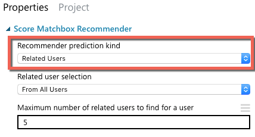 

2. Run the experiment and visualize the output port.  

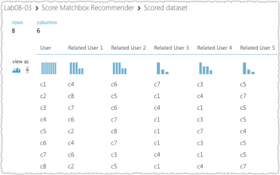 

3. As you can see from the output users c4, c6, c7, c3, c5 are related with user **c1** in that order. If you check the data, you will see that users recommended here, all enjoy vegetables like user **c1**. Moreover since we set our system to propose 5 recommendations, it proposed that user **c5** is related to user **c1**, even though they prefer grill. 

## 1.5. Find related items
Next we willfind related items. This approach can be used to recommend items to a user based on items they like. i.e., if Item X and Item Y have similar profiles or if Item X and Item Y are bought together, then you may want to recommend item Y to a user who selects item X.

1. Set the *Recommender prediction kind** property to "Related Items"

 

2. Run the experiment and visualize the output port.  

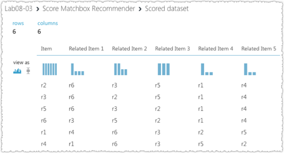  

3. You will see the grill restaurants are related to each other while the vegeterian restaurants are related each other.  

## 1.6. Recommendations for a new user
The above samples are using existing users to make recommendations. To make recommendations for new user, you will need to work with all three data tables provided. You will also need some features of the new user (In our case it is the type column in the user table). 

### 1.6.1. Deploying the web service for a brand new user
1. Set "Score Matchbox Recommender" to **3** with below settings.

  

2. Run the experiments.  

3. Create a predictive experiment.

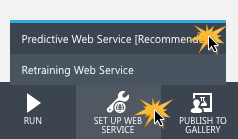  

4. Add a second web service input module as shown in the workflow below then Run the predictive experiment.

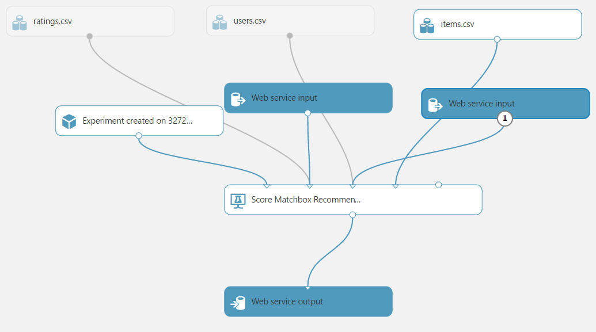  

5. Deploy the web service.  

  

### 1.6.2. Testing the web service
1. The published web service dashboard will open. Because we have more than one webservice input, we can't use the "Test dialog input" so we will click on the "Excel app" link to download a sample excel file to test our web service.

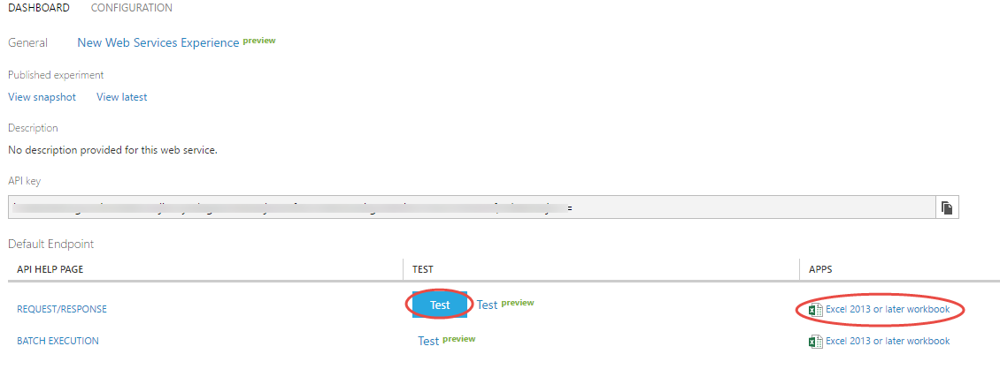  

2. Download the Excel file then open it. (You should click "enable content" button in case your computer's security doesnt allow you to open Excel apps)

3. Click on the webservice name.  

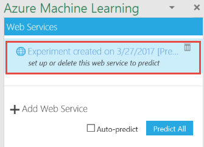  

4. On the top row of the Excel sheet, in order, write the following values in each cell:
  
| A         | B   | C        | D          | E    |
| ---       | --- | ---      | ---        | ---  |
|customerId |type |customerId|restaurantId|rating|
| NEWC01    | v   | NEWC01   |            |      ||
  

5. As there are two web service input, you need to enter the customer id twice. New users **must have** unique IDs that do not exist in the training data. So we use **NEWC01** as our new user ID. Also as mentioned earlier, new user data must contain the feature values. In our case feature data is **v** which means the customer is a vegeterian or likes vegetable plates. Keep the ratings data empty (except the same unique id). Now adjust the Excel web service app's parameters. You will need to specify the source cells for the web service's input and output ports. Type "Sheet1!C1:E2" for input1, "Sheet1!A1:B2" for input2, and type "Sheet1!A5" for the address of the cell where the webservice output will be printed. Finally, press the *Predict* button. 

    - Please note that if there is an error caused by the inputs it could be due to swapped inputs. Therefore, try typing "Sheet1!A1:B2" for input1, and "Sheet1!C1:E2" for input2.  

     

6. The results are not surprising. For a new users who are vegeterians, recommended restaurants are, in order: r5, r2, r3 which are indeed vegeterian restaurants.   

   

### 1.6.3. Consuming the web service in an application
1. Open up Visual Studio 2017 or Visual Studio 2015.

2. Create a new project.  

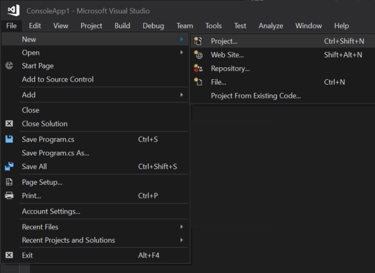 

3. Select C# Console application and click OK to create a blank application template.  

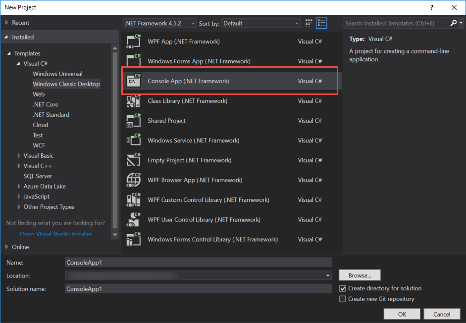

4. Once the project has been created, in the “Solution Explorer” window, right click on the project name “ConsoleApplication1” (if you haven’t changed the default project name) and select the “Manage NuGet Packages…” menu item in the pop-up menu.


5. The “NuGet Package Manager” window will open in a new tab. Type “Microsoft.AspNet.WebApi.Client” in the search box then click on the “Install” button to have this package installed in your console application. This package is used for content negotiation over networks with JSON formatting, which is the web service requirement.


6. Once the package has installed, switch back to the “Program.cs” file tab or double click on the “Program.cs” file name in the “Solution Explorer” window. Here we will type our C# commands to call the web service and show the results.  

7. The C# code that we will write in the “Program.cs” file is actually already in Azure Machine Learning Studio. Switch back to the Web Service page in Azure Machine Learning Studio, where we made the tests in the previous section. On this page, click on the “REQUEST/RESPONSE” link under the “Default Endpoint” section.  

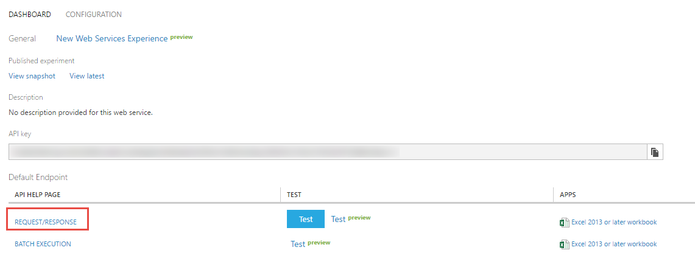

8. A new web page called "Request Response API Documentation" will open. Scroll to the section labeled “Sample Code”. In the “Sample Code” section, the C# tab is selected by default. Click on the “Select sample code” button on the top right corner of this section then copy the code.  


9. Paste the code over all other content in “Program.cs” in Visual Studio.


10. Now we need to make few simple changes to that code. Find the line that starts with:

    ```c#
    const string apiKey = "abc123";
    ```  
    
    On this line we need to replace “*abc123*” with another string. This will be like a password to access our web service. Without this key/password, it is not possible to call our web service, otherwise anyone could run up your Azure bill by calling the service over and over. 

11. Go back to the Azure Machine Learning web service page and copy the secret “API key”. Replace the above “*abc123*” string with the Key.


12. Update the following code to pass in valid Input parameters.

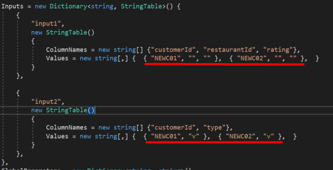

13. Now we are ready to run the sample C# application. Press *CTRL* + *F5*. Below is a sample of the output. As you can see the restuarants r5, r2, and r3 are recommended for both the new users. This makes sense because we provided identical inputs.


## 1.7. Conclusion  
You have successfully built, deployed, and consumed a Machine Learning solution using Azure Machine Learning and Visual Studio!
